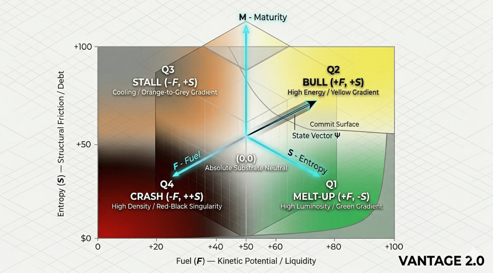

# VANTAGE 2.0 | Predictive Systems Engine
### (Kinetics + Entropy + Time)

> **Architectural Status:** Operational. This repository contains the **PNSM (Physics-Native Systems Modeling)** framework, designed to map systemic trajectories across a multidimensional predictive manifold.

---

## 🧭 The VANTAGE 2.0 Compass
The Compass is the primary visual telemetry for the engine. It maps the **Drift Vector ($\mathbf{D}$)** calculated by the core logic into four distinct systemic regimes:

| Regime | Systemic State | Strategic Action | Angle ($\Theta$) |
| :--- | :--- | :--- | :--- |
| **MELT-UP** | High Fuel + High Speed | **Aggressive Long** | $0 \to \pi/2$ |
| **BULL TREND** | High Fuel + Low Speed | **Leveraged Long** | $-\pi/2 \to 0$ |
| **STALL / ROT** | Low Fuel + Low Speed | **Cash / Yield** | $-\pi \to -\pi/2$ |
| **CRASH** | Low Fuel + High Speed | **Hard Short** | $\pi/2 \to \pi$ |

---

## 🛠 Core Components
### 🛠 Core Components

### 🛠 Core Components

### 🛠 Core Components

* [Normalization Substrate](./vantage/normalization.py): Signal stabilization and invariant enforcement.
* [Predictive Manifold](./docs/PREDICTIVE_MANIFOLD.md): 60-section geometric modeling of state evolution.
* [Regime Boundaries](./spec): Mathematical definitions of phase transitions.
* [Drift Engine](./vantage/phase_space.py): Python implementation of state-vector velocity.
  
# VANTAGE 2.0

**Regime‑Aware Predictive Intelligence Engine**

## Executive Summary
Vantage 2.0 is a regime‑aware intelligence engine that models complex environments through entropy, momentum, and structural drift. It treats systems as evolving fields, identifies instability before it becomes observable, and generates predictive trajectories grounded in physics‑native dynamics rather than statistical assumptions.

## Core Architecture

### Dual‑Axis Modeling
Vantage 2.0 operates on two orthogonal axes:
- **Entropy Axis**: measures disorder, dispersion, and systemic uncertainty.
- **Momentum Axis**: captures directional pressure, persistence, and kinetic bias.

### Standardized Normalization ($F, S, M$)
All signals are mapped to the closed interval $[0, 1]$ to maintain manifold stability and prevent derivative jitter. This ensures the deterministic activation of instability triggers:

$$
\vec{a}_s > \gamma s
$$

### State‑Transition Dynamics
Models transitions as entropy‑driven expansions ($\Delta S > 0$) or contractions ($\Delta S < 0$), momentum‑driven accelerations, and hybrid states where drift and volatility interact.

## System Capabilities
* **Regime Classification**: Identifies active system stability.
* **Structural Drift Mapping**: Detects cumulative deformation.
* **Predictive Trajectory Generation**: Produces forward-looking paths.
* **Decision‑Support Visualizations**: Highlights pressure zones and risk surfaces.

## Visual Model

## Deep-Dive Documentation
For a full technical breakdown of the physics-native logic and regime boundary definitions, see the [Strategic Framework](./docs/STRATEGIC_FRAMEWORK.md).

## License
**Proprietary & Confidential.** All rights reserved. No part of this system may be copied, modified, or distributed without explicit written permission. Cloning or derivative reuse is strictly prohibited.
